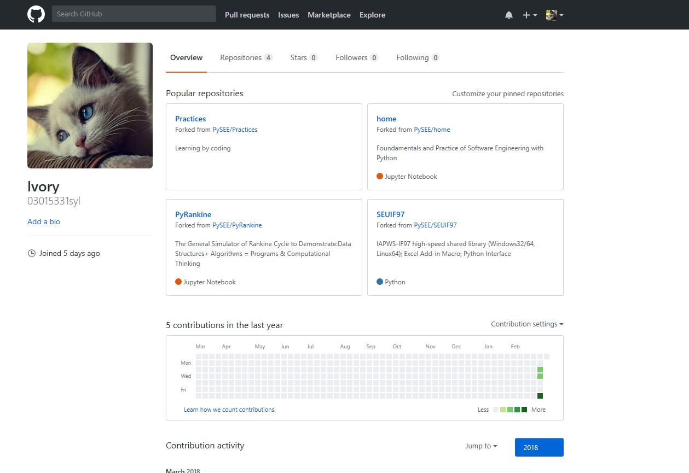
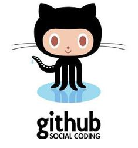

# **软件工程作业一*
*03015331-孙雅蕾

## 一、 个人Github账户
- * Name：Lvry
- * Emill：m18133889118@163.com
- * printscreen：  

  

## 二、 Github 简介
  社交编程及代码托管网站

>Github首先被国内关注，是由于一次“限制访问”的风波。其实，它作为开源代码库以及版本控制系统，目前已经拥有140多万开发者用户。随着越来越多的应用程序转移到了云上，Github已经成为了管理软件开发以及发现已有代码的首选方法。由于托管了大量的开源项目，这里也成为了学习与交流的最佳平台。如今，能够使用git管理代码已经成了程序员最基本的技能之一 
### 1.什么是Github
> 我们的程序最终在运行的时候，我们会对它进行版本的修改。比如：今天某个地方需要加个需求,明天某个地方的代码进行了删除，或者今年跟去年的版本不一样。这时我们就需要一个东西来帮助我们记录我们在什么时候干了什么事，对什么地方进行了修改。 
于是，一个东西诞生了。它就是git，源代码管理工具. 这里有必要说一下，git的”父亲” Linus Torvalds（李纳斯 托沃兹）。此人也就是linux的制作人
### 2.Github的基本功能
* *Repository*：分为公共仓库和私人仓库，仓库包含了所有的：版本、分支、标记信息。  
* *Explore*：发现、查看、研究Github上公共仓库中托管的代码项目。  
* *Gist*：有版本控制的代码粘贴服务，由此可以方便地共享文本或代码。  
* *Blog*：个人博客，只要向Github提交Commit就能发布新文章。  
* *Watch*：将感兴趣的仓库加入关注列表，如果所关注的仓库有更新会动态的进行邮件通知。  
* *Star*：一种更新的方式管理你所感兴趣的仓库的记录，任何之前预览过的仓库都能在其页面中找到。  
* *Fork*：最重要的功能之一，克隆别人仓库的代码到自己的项目中。可以作为子模块的形式使用，或二次开发。

## 三、 课程Home、PyRankine和SEUIF97仓库简介  
>Home、PyRankine和SEUIF97都是上面所说的“Repository”，我现在已经将它们从PySEE拥有者那里fork到了自己的仓库中，相当于我在原项目的主分支上又建立了一个分支，我可以在该分支上任意修改，如果想将我的修改合并到原项目中时，可以pull request，这样原项目的作者就可以将我修改的东西合并到原项目的主分支上去，这样我就为开源项目贡献了代码，开源项目就会在大家共同的努力下不断壮大和完善。  

### 1. Home仓库：    
> Home仓库里放的主要是学习Python编程的一些指导，仓库中文件README.md是对该仓库的介绍。notebook文件中是对Python语言学习的课件和一些可供参考和学习的代码。guide文件内容是指导学习的一些技巧。

### 2. PyRankine仓库：  

> 郎肯循环是我们专业一个重要的内容，也是我们专业学习和研究的基础，PyRankine仓库主要介绍如何利用Python语言模拟和计算郎肯循环，数据结构+算法=程序或者计算思维。仓库中文件主要介绍了计算思维和编程技巧，通过一步一步拆分讲解的方式，并且给出了郎肯循环的编程示例和许多参考网站和教程。  

### 3. SEUIF97仓库：  
 
> 由于计算时间的限制，直接使用IAPWS-IF97可能不适用。为此，东南大学研发了一个高速共享库，用于研发人员的过程模拟（如计算流体力学、热循环计算、非平稳过程模拟和实时模拟）中计算水和水蒸气的性质。通过高速库，Iapws-If97产生了3倍的计算速度。该仓库主要介绍了在windows和Linux环境下的使用方法，和DEMO程序，可供交互学习，是一个开源的仓库。
